# **PRUEBA INDIVIDUAL – RA2 - HTML+CSS AIDAN GUZMÁN POSTIGO**

ENLACE AL REPOSITORIO CON MODIFICACIONES: https://github.com/AidanGuzmanPostigo/MiniProyectoHTML-CSS---Examen09-12.git

## Ejercicio 1

### Ejercicio 1A
No se centra porque (además de que falta enlazar el css en el archivo html) el header de la web se está mostrando con flex sin utilizar una flex direction así que se mantiene centrado respecto al eje x (vertical), se puede cambiar poniendo un flex direction column para que se centre respecto al eje y (horizontalmente).

### Ejercicio 1B
Para centrarlo usando flex es tan sencillo como usar flex direction column para que se distribuya en columnas y luego usar align items: center para que se centre respecto al eje y.

```css
.site-header {
  display: flex;
  align-items: center;
  flex-direction: column;
}
```
Para centrarlo usando grid podemos usar la propiedad justify-items además de utilizar display: grid para que se centre respecto al eje y.
```css
.site-header {
  display: grid;
  justify-items: center;
}
```
### Ejercicio 1C
Voy a usar la misma estructura con flex del ejercicio anterior añadiendo un gap que sirve para dar margen entre los elementos del header.
```css
.site-header {
  display: flex;
  align-items: center;
  flex-direction: column;
  gap: 30px;
}
```
### Ejercicio 1D
Teniendo de base lo realizado en el anterior ejercicio, le aplicamos background-color para aplicar un color al fondo del header, luego un border-bottom para aplicar un borde inferior, en este caso usando el estilo dotted, con un tamaño de 5px y de color verde, luego usar un box-shadow para aplicar más separación visual entre el header, el resto de los elementos y por último he aplicado padding para que los elementos de dentro del header no se queden pegados a los bordes.
```css
.site-header {
  display: flex;
  align-items: center;
  flex-direction: column;
  gap: 30px;
  background-color: aquamarine;
  border-bottom: dotted green 5px;
  box-shadow: 10px 10px 5px 0px rgba(0,0,0,0.75);
  padding: 1em;
}
```
## Ejercicio 2

### Ejercicio 2A
Simplemente cambio el <button> para introducirlo al header, de manera que queda así:
```html
<header class="site-header">
    <h1>Balatro</h1>
    <nav class="main-nav">
      <ul>
        <li><a href="#hero">Inicio</a></li>
        <li><a href="#galery">Galería</a></li>
        <li><a href="#table">Manos</a></li>
        <li><a href="#form">Suscripción</a></li>
        <li><a href="#RRSS">Contacto</a></li>
      </ul>
    </nav>
    <button class="open-menu" aria-label="Abrir menú lateral"></button>
  </header>
```
### Ejercicio 2B
Primero para poder maquetar el header utilizamos flex alineando los objetos a la derecha con justify-content:rigth haciendo que todos elementos se muevan hacia el borde horizontal derecho, luego en el h1 colocamos la propiedad position absolute para que de manera inmutable el elemento (en este caso el h1) se quede en la posición que se quiera, en este caso utilizando left: 50% forzamos a que el titulo se quede centrado horizontalmente, respecto al botón utilizamos position: fixed para que siempre se quede en la misma posición, incluso si abrimos la página en dispositivos con una pantalla más pequeña.
```css
.site-header {
  position: sticky;
  top: 0;
  z-index: 10;
  background-color: #1b5349;
  padding: 1em;
  display: flex;
  align-items: center;
  justify-content: right;
}
.site-header h1 {
  position: absolute;
  left: 50%;
  transform: translateX(-50%);
  font-family: "Balatro";
}
.site-header a {
  font-family: "Balatro";
}
.main-nav ul {
  list-style: none;
  display: flex;
  gap: 10px;
}
.open-menu {
  position: fixed;
  top: 14px;
  left: 10px;
  z-index: 20;
  font-size: 26px;
  background: none;
  border: none;
  cursor: pointer;
  transition: transform 0.3s ease, background-color 0.3s ease;
  font-family: "Balatro";
}
.side-menu {
  position: fixed;
  top: 0;
  left: -230px;            
  width: 230px;
  height: 100%;
  padding-top: 60px;
  transition: left 0.3s ease;
  z-index: 15;
  background-color: #11685b;
  font-family: "Balatro";
}
.side-menu.active {
  left: 0;                 
}
```
## Ejercicio 3

### Ejercicio 3A
En este caso ya tenía las imágenes como miniaturas ya que al haber usado grid y varias imágenes por fila se hicieron más pequeñas además de aplicarles un 80% de width para que se viesen aún más pequeñas.

### Ejercicio 3B
En este caso ya disponía de un efecto para cuando el ratón pasase por las imágenes, justamente "transform: scale(1.03);" que está aplicado a todas las imágenes de la página web que contienen cualquier tipo de enlace, respecto al borde se le ha añadido un borde con background-color a todas las imágenes cuando el cursor pasa por ellas.
(Revisión 09/12/2025 17:48 - Me acabo de dar cuenta de que realmente en vez de background color, lo que se debería haber realizado es la propiedad border: seguido de los parámetros deseados, lo apunto como pequeña anotación).

### Ejercicio 3C
Mi página web también contaba con esta característica que simplemente es añadir un enlace a la imágen para que lleve a la ruta donde la imagen completa está alojada.

Resultado final: 
```html
<section id="galery">
      <h2>Galería de imágenes</h2>
      <figure>
        <a href="img/gallery1.png"></a>
        <a href="img/gallery2.png"></a>
        <a href="img/gallery3.png"></a>
        <a href="img/gallery4.png"></a>
        <a href="img/gallery5.png"></a>
        <a href="img/gallery6.png"></a>
        <a href="img/gallery7.png"></a>
        <a href="img/gallery8.png"></a>
        <a href="img/gallery9.png"></a>
        <a href="img/gallery10.png"></a>
        <a href="img/gallery11.png"></a>
        <a href="img/gallery12.png"></a>
      </figure>
    </section>
```
```css
a:hover{
  background-color: #1b3748;
}
main a{
  text-decoration: underline #1b3748;
}
#galery figure {
  display: grid;
  grid-template-rows: repeat(3, auto);
  grid-template-columns: repeat(4, 1fr);
  gap: 20px;
}

#galery img {
  width: 80%;
  height: auto;
  object-fit: cover;
  border-radius: 10px;
  margin: auto;
  display: block;
}
```
## Ejercicio 4

### Ejercicio 4.1
Mi página web trata sobre Balatro, un juego roguelike que a nivel personal me ha inspirado bastante, en la web he incluido varios articulos con información sobre el juego como  el contenido mecánico de este, información sobre el autor, la importancia de este juego en la industria y la explicación mecánica del juego, además de esto he incluido secciones como la galería, un formulario, una tabla con las manos del juego y una lista con las redes oficiales tanto del juego como del creador, la idea de diseño es que fuese atractivo a la vista y que generase interés en el lector para probar el juego, la paleta de colores está inspirada en el juego.

### Ejercicio 4.2
El header está usado para mostrar el menú lateral desplegable, el título (h1) de la página web y los enlaces de la barra de navegación.
Contiene los siguientes elementos: Título (h1), Botón para abrir el menú lateral desplegable y el menú principal de navegación.
Este header es sticky ya que eso permite acceder a este menú mientras el usuario sigue desplazandose hacia debajo en la página, lo que permite el acceso rápido a las diferentes secciones de la web.

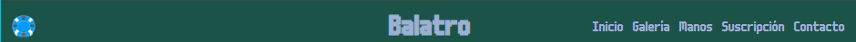

```html
<header class="site-header">
    <h1>Balatro</h1>
    <nav class="main-nav">
      <ul>
        <li><a href="#hero">Inicio</a></li>
        <li><a href="#galery">Galería</a></li>
        <li><a href="#table">Manos</a></li>
        <li><a href="#form">Suscripción</a></li>
        <li><a href="#RRSS">Contacto</a></li>
      </ul>
    </nav>
    <button class="open-menu" aria-label="Abrir menú lateral"></button>
  </header>
```
En el main se encuentra todo el contenido dividido entre distintas secciones, además de que en la sección hero se encuentran todos los article con la información principal de la página.

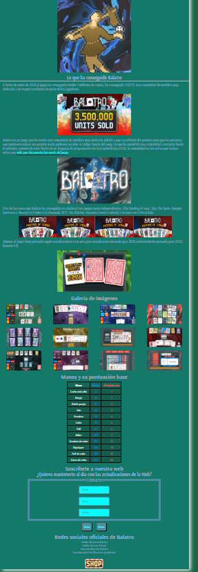

```html
<main>
    <section id="hero">
      <header>
        <h2>¿Qué es Balatro?</h2>
        <p>Balatro es un videojuego del género roguelike desarrollado por un desarrollador independiente que se hace llamar <a href="https://localthunk.com/"><strong><em class="golden">"LocalThunk"</em></strong>.</a></p>
      </header>
      <article id="artJugabilidad">
        <figure>
          
        </figure>
        <h3>Mecánica central</h3>
        <hr>
        <p>Según la propia página de Steam: "El roguelike de póker. Balatro es un hipnótico y genial constructor de mazos donde podrás jugar manos ilegales de póker, descubrir comodines que alterarán tus partidas y activar combos impresionantes que dispararán tu adrenalina."</p>
        <p>El juego consiste en realizar combinaciones con manos de póker, mejoras y una serie de cartas especiales llamadas comodines obtener la mayor cantidad de fichas (<strong><em class="white">puntuación</em></strong>) posible, ir subiendo la apuesta mientras los enemigos cada vez piden una mayor <strong><em class="white">puntuación</em></strong> para ser superados.</p>
        <figure>
          
        </figure>
        <p>Para conseguir la puntuación jugaremos una serie de manos basadas en las manos del póker (además de 3 variaciones secretas) que sumarán cierta cantidad de <strong><em class="blue">fichas</em></strong> y de <strong><em class="red">multiplicador</em></strong>, el resultado de esto se añadirá a las fichas de la ronda y si la putuación requerida es superada antes de quedarte sin manos avanzarás a la siguiente ronda, en caso contrario la partida se habrá perdido la partida.</p>
        <figure>
          
        </figure>
        <figure class="video">
          <iframe width="560" height="315" src="https://www.youtube.com/embed/ihXbieFr1Xs?si=0LGPO3aRHGvnYOdx" title="Balatro tutorial" frameborder="0" allow="accelerometer; autoplay; clipboard-write; encrypted-media; gyroscope; picture-in-picture; web-share" referrerpolicy="strict-origin-when-cross-origin" allowfullscreen></iframe>
        </figure>
      </article>
      <article id="artContenido">
        <h3>Contenido</h3>
        <hr>
        <p>El juego cuenta con una cantidad enorme de contenido que hace que cada partida se sienta completamente diferente de las anteriores y que permite que el juego se sienta innovador incluso si has jugado una gran cantidad de horas.</p>
        <p>Respecto a datos más concretos, Balatro cuenta con <strong><em>150 comodines</em></strong>, cada uno con su efecto único y tan distintos como los dos siguientes:</p>
        <figure>
          <a href="https://balatro.fandom.com/es/wiki/Comodín"></a>
          <a href="https://balatro.fandom.com/es/wiki/Cara_aterradora"></a>
        </figure>
        <p>Además de los comodines existen:</p> 
        <ul>
          <li><strong><em class="deck">15 barajas</em></strong> cada una dando una experiencia única a cada partida.</li>
          <li><strong><em class="voucher">32 modificadores pasivos</em></strong> que dan mejoras para la partida en la que se obtienen.</li>
          <li>Una serie de consumibles divididos entre:
            <ul>
              <li><strong><em class="tarot">22 cartas de tarot</em></strong>, sirven para modificar la baraja, obtener dinero, etc...</li>
              <li><strong><em class="spectral">18 cartas espectrales</em></strong>, son como las cartas del tarot pero con efectos más potentes y arriesgados.</li>
              <li><strong><em class="planet">12 cartas de planetas</em></strong>, aumentan la puntuación base de las diferentes manos de póker.</li>
            </ul>
          </li>
          <li><strong><em class="boss">28 tipos de jefes</em></strong>, cada uno con una penalización diferente para el jugador.</li>
          <li><strong><em>Mejoras adicionales</em></strong> que permiten mejorar las cartas de la baraja así como los diferentes comodines del juego.</li>
        </ul>
      </article>
      <article id="artEjemploIndustria">
        <h3>¿Por qué es Balatro un ejemplo para la industria?</h3>
        <hr>
        <p>Balatro ha sido todo un ejemplo en una industria saturada de juegos clonicos y "sin alma" y ha supuesto un "golpe sobre la mesa" para la industria, siendo nominado en premios tan importantes como "The Game Awards" en 5 categorías (Entre ellas juego del año 2024) y ganando 3 de estas (Mejor juego móvil 2024, mejor juego indie y mejor debut indie).</p>
        <figure>
          
        </figure>
        <p>Balatro no es el primer juego indie que ha salido al mercado, ni siquiera en su propio género, pero el magnífico diseño de juego, sus casi infinitas posibilidades y lo divertido y adictivo que reuslta el juego hacen de este una experiencia muy original y divertida para todo aquel que quiera jugarlo.</p>
        <figure>
          
        </figure>
      </article>
      <article id="artPersonal">
        <h3>¿Por qué hablar de Balatro en este espacio?</h3>
        <hr>
        <p>A nivel personal, considero que Balatro, así como otros muchos videojuegos independientes aportan "alma" a una industria que cada vez se siente más artificial, juegos como The Binding of Isaac, Inscryption, The Hex, Vampire Survivors o el mismo Balatro.</p>
        <p>En concreto he elegido Balatro ya que, sin ser mi videojuego favorito o al que más tiempo le he dedicado ha sido un videojuego que me ha fascinado tanto que hizo que me lo completase al 100% (Lo que no es una tarea sencilla), además de sentir una gran inspiración por el autor y su obra tan especial que es Balatro.<p>
        <p>Además de lo anteriormente mencionado en mi caso personal ha sido un choque muy grande ver todo lo que el juego ha logrado ya que en un futuro a mi también me gustaría desarrollar videojuegos independientes, y esta clase de historias ayudan para tener motivación para el futuro.</p>
        <figure>
          
        </figure>
      </article>
      <article id="artLocalThunk">
        <h3>Localthunk</h3>
        <hr>
        <p>LocalThunk (Creador de Balatro) es un desarrollador independiente que desarrollaba por hobby videojuegos sencillos para jugar con sus amigos y, uno de estos prototipos que Localthunk enseñó gustó tanto a sus amigos que estos le convencieron para que desarrollase el juego completo.</p>
        <p>Balatro no estaba pensado para ser una historia de éxito, todo lo contrario, LocalThunk no quiso jugar ningún juego del género para no "inspirarse en otras filosofias de diseño", lo que hoy en día es inpensable para cualquiera que quiera desarrollar videojuegos comerciales.</p>
        <p>Conforme el desarrollo iba llegando a su fin LocalThunk comenzó a desarrollar problemas de Ansiedad por todo lo que estaba generando el juego, pero según él "Mereció la pena", él mismo confesó haber jugado al juego como un jugador más antes de la salida y le resultó fascinante además de sentirse orgulloso de su trabajo.</p>
        <p>A día de hoy el rostro y nombre real del autor se desconocen, pues él mismo quiere permanecer en el mayor anonimato posible.</p>
        <p>LocalThunk cuenta con un blog (si quieres acceder haz click en el nombre de Localthunk arriba).</p>
        <figure>
          
        </figure>
      </article>
      <article id="artConseguido">
        <h3>Lo que ha conseguido Balatro</h3>
        <hr>
        <p>A fecha de enero de 2025 el juego ha conseguido vender 5 millones de copias, ha conseguido 3 GOTY, una comunidad de modders muy dedicada y un respeto profundo de parte de los jugadores.</p>
        <figure>
          
        </figure>
        <p>Balatro es un juego que ha tenido una comunidad de modders muy dedicada debido a que Localthunk dió permiso para que las personas que quisiesen realizar sus propios mods pudiesen acceder al código fuente del juego, lo que ha permitido una comunidad constante desde el principio, además de estar hecho en un lenguaje de programación de fácil aprendizaje (LUA), la comunidad es tan activa que incluso existe una <a href="https://balatromods.miraheze.org/wiki/Main_Page"><em>wiki que documenta los mods del juego</em></a>.</p>
        <figure>
          
        </figure>
        <p>Otra de las cosas que Balatro ha conseguido es colaborar con juegos tanto independientes, (The Binding of Isaac, Slay The Spire, Vampire Survivors o Among Us) triples A (Cyberpunk 2077, The Witcher, Assasins Creed o Fallout) o incluso con Critical Role.</p>
        <figure class="collab">
          <a href="https://youtu.be/qChMssQkk3M?si=3MTeWUAS6rqZJNrQ"></a>
          <a href="https://youtu.be/tQAUHE5CNOw?si=-zd6o8VQ7ZJ0JlSA"></a>
          <a href="https://youtu.be/1r1LVgAGXlE?si=mJPJWEycJ3CfFo_o"></a>
          <a href="https://youtu.be/0G24sFdbXws?si=BlA5tvLMCndHG4W4"></a>
        </figure>
        <p>Además el juego tiene pensado seguir actualizandose (con una gran actualización pensada para 2026 (anteriormente pensada para 2025) llamada 1.1).</p>
        <figure>
          
        </figure>
      </article>
    </section>
    <section id="galery">
      <h2>Galería de imágenes</h2>
      <figure>
        <a href="img/gallery1.png"></a>
        <a href="img/gallery2.png"></a>
        <a href="img/gallery3.png"></a>
        <a href="img/gallery4.png"></a>
        <a href="img/gallery5.png"></a>
        <a href="img/gallery6.png"></a>
        <a href="img/gallery7.png"></a>
        <a href="img/gallery8.png"></a>
        <a href="img/gallery9.png"></a>
        <a href="img/gallery10.png"></a>
        <a href="img/gallery11.png"></a>
        <a href="img/gallery12.png"></a>
      </figure>
    </section>
    <section id="table">
      <h2>Manos y su puntuación base</h2>
      <table>
        <tr>
          <th><em class="white">Mano<em></th>
          <th><em class="blue">Fichas</em></th>
          <th><em class="red">Multiplicador</em></th>
        </tr>
        <tr>
          <td><em class="white">Carta más alta<em></td>
          <td><em class="blue">5</em></td>
          <td><em class="red">1</em></td>
        </tr>
        <tr>
          <td><em class="white">Pareja<em></td>
          <td><em class="blue">10</em></td>
          <td><em class="red">2</em></td>
        </tr>
        <tr>
          <td><em class="white">Doble pareja<em></td>
          <td><em class="blue">20</em></td>
          <td><em class="red">2</em></td>
        </tr>
        <tr>
          <td><em class="white">Trio<em></td>
          <td><em class="blue">30</em></td>
          <td><em class="red">3</em></td>
        </tr>
        <tr>
          <td><em class="white">Escalera<em></td>
          <td><em class="blue">30</em></td>
          <td><em class="red">4</em></td>
        </tr>
        <tr>
          <td><em class="white">Color<em></td>
          <td><em class="blue">35</em></td>
          <td><em class="red">4</em></td>
        </tr>
        <tr>
          <td><em class="white">Full<em></td>
          <td><em class="blue">40</em></td>
          <td><em class="red">4</em></td>
        </tr>
        <tr>
          <td><em class="white">Póker<em></td>
          <td><em class="blue">60</em></td>
          <td><em class="red">7</em></td>
        </tr>
        <tr>
          <td><em class="white">Escalera de color<em></td>
          <td><em class="blue">100</em></td>
          <td><em class="red">8</em></td>
        </tr>
        <tr>
          <td><em class="white">Repóquer<em></td>
          <td><em class="blue">120</em></td>
          <td><em class="red">12</em></td>
        </tr>
        <tr>
          <td><em class="white">Full de color<em></td>
          <td><em class="blue">140</em></td>
          <td><em class="red">14</em></td>
        </tr>
        <tr>
          <td><em class="white">Cinco de color<em></td>
          <td><em class="blue">160</em></td>
          <td><em class="red">16</em></td>
        </tr>
      </table>
    </section>
    <section id="form">
      <h2 id="contacto">Suscribete a nuestra web</h2>
      <h3>¿Quieres mantenerte al día con las actualizaciones de la Web?</h3>
      <form class="contacto">
        <fieldset id="fset1">
          <legend>Contacto</legend>
          <input type="text" placeholder="Nombre" required name="Nombre">
          <input type="email" placeholder="Correo" required name="Email">
          <input type="tel" placeholder="Teléfono" required name="Telf">
        </fieldset>
        <button type="submit"><strong><em>Enviar</em></strong></button>
        <button type="reset"><strong><em>Borrar</em></strong></button>
      </form>
    </section>
    <section id="RRSS">
      <h2>Redes sociales oficiales de Balatro</h2>
      <ul>
        <li><a href="https://x.com/BalatroGame">Twitter oficial de Balatro</a></li>
        <li><a href="https://x.com/LocalThunk">Twitter de LocalThunk</a></li>
        <li><a href="https://discord.com/invite/5mH3dNhjx2">Discord oficial de Balatro</a></li>
        <li><a href="https://www.youtube.com/@playstack">Youtube oficial de Playstack (publisher)</a></li>
      </ul>
      <a href="https://store.steampowered.com/app/2379780/Balatro/" id="Steam"></a>
    </section>
  </main>

```

En los section se encuentran las diferentes secciones de la web (Hero, gallery, table, form y RRSS), cada una de estas con diferentes características.

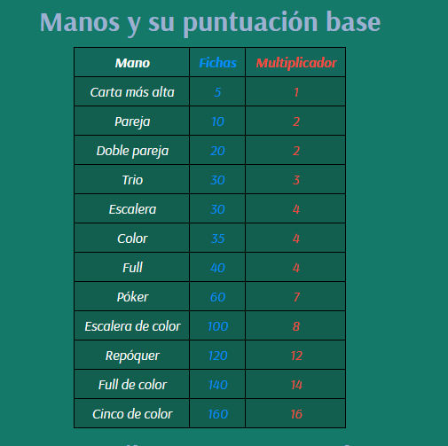

```html
<section id="table">
      <h2>Manos y su puntuación base</h2>
      <table>
        <tr>
          <th><em class="white">Mano<em></th>
          <th><em class="blue">Fichas</em></th>
          <th><em class="red">Multiplicador</em></th>
        </tr>
        <tr>
          <td><em class="white">Carta más alta<em></td>
          <td><em class="blue">5</em></td>
          <td><em class="red">1</em></td>
        </tr>
        <tr>
          <td><em class="white">Pareja<em></td>
          <td><em class="blue">10</em></td>
          <td><em class="red">2</em></td>
        </tr>
        <tr>
          <td><em class="white">Doble pareja<em></td>
          <td><em class="blue">20</em></td>
          <td><em class="red">2</em></td>
        </tr>
        <tr>
          <td><em class="white">Trio<em></td>
          <td><em class="blue">30</em></td>
          <td><em class="red">3</em></td>
        </tr>
        <tr>
          <td><em class="white">Escalera<em></td>
          <td><em class="blue">30</em></td>
          <td><em class="red">4</em></td>
        </tr>
        <tr>
          <td><em class="white">Color<em></td>
          <td><em class="blue">35</em></td>
          <td><em class="red">4</em></td>
        </tr>
        <tr>
          <td><em class="white">Full<em></td>
          <td><em class="blue">40</em></td>
          <td><em class="red">4</em></td>
        </tr>
        <tr>
          <td><em class="white">Póker<em></td>
          <td><em class="blue">60</em></td>
          <td><em class="red">7</em></td>
        </tr>
        <tr>
          <td><em class="white">Escalera de color<em></td>
          <td><em class="blue">100</em></td>
          <td><em class="red">8</em></td>
        </tr>
        <tr>
          <td><em class="white">Repóquer<em></td>
          <td><em class="blue">120</em></td>
          <td><em class="red">12</em></td>
        </tr>
        <tr>
          <td><em class="white">Full de color<em></td>
          <td><em class="blue">140</em></td>
          <td><em class="red">14</em></td>
        </tr>
        <tr>
          <td><em class="white">Cinco de color<em></td>
          <td><em class="blue">160</em></td>
          <td><em class="red">16</em></td>
        </tr>
      </table>
    </section>
```

En el footer se encuentra el copyright con un enlace que lleva al inicio de la página web.


```html
<footer class="site-footer">
    <p><a href="#hero">&copy; 2025 — 1º DAM, IES Saladillo</a></p>
  </footer>
```

En el menú superior o nav se encuentran los enlaces principales dentro de la barra de navegación.

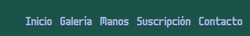

```html
<nav class="main-nav">
      <ul>
        <li><a href="#hero">Inicio</a></li>
        <li><a href="#galery">Galería</a></li>
        <li><a href="#table">Manos</a></li>
        <li><a href="#form">Suscripción</a></li>
        <li><a href="#RRSS">Contacto</a></li>
      </ul>
    </nav>
```

El menú lateral consiste de un botón (acabé sustituyendolo por una imagen) que abre una barra lateral de búsqueda con enlaces a las secciones de la web.

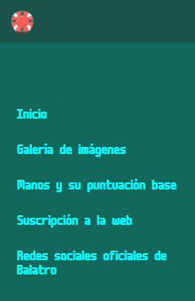

```html
    <button class="open-menu" aria-label="Abrir menú lateral"></button>

```

La sección Hero es la sección principal que contiene todos los article con la información.

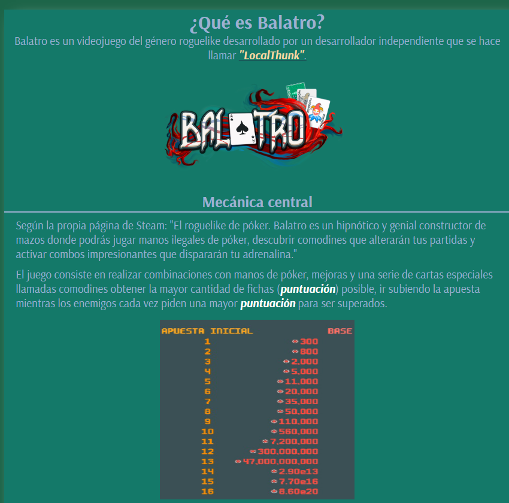

```html
<section id="hero">
      <header>
        <h2>¿Qué es Balatro?</h2>
        <p>Balatro es un videojuego del género roguelike desarrollado por un desarrollador independiente que se hace llamar <a href="https://localthunk.com/"><strong><em class="golden">"LocalThunk"</em></strong>.</a></p>
      </header>
      <article id="artJugabilidad">
        <figure>
          
        </figure>
        <h3>Mecánica central</h3>
        <hr>
        <p>Según la propia página de Steam: "El roguelike de póker. Balatro es un hipnótico y genial constructor de mazos donde podrás jugar manos ilegales de póker, descubrir comodines que alterarán tus partidas y activar combos impresionantes que dispararán tu adrenalina."</p>
        <p>El juego consiste en realizar combinaciones con manos de póker, mejoras y una serie de cartas especiales llamadas comodines obtener la mayor cantidad de fichas (<strong><em class="white">puntuación</em></strong>) posible, ir subiendo la apuesta mientras los enemigos cada vez piden una mayor <strong><em class="white">puntuación</em></strong> para ser superados.</p>
        <figure>
          
        </figure>
        <p>Para conseguir la puntuación jugaremos una serie de manos basadas en las manos del póker (además de 3 variaciones secretas) que sumarán cierta cantidad de <strong><em class="blue">fichas</em></strong> y de <strong><em class="red">multiplicador</em></strong>, el resultado de esto se añadirá a las fichas de la ronda y si la putuación requerida es superada antes de quedarte sin manos avanzarás a la siguiente ronda, en caso contrario la partida se habrá perdido la partida.</p>
        <figure>
          
        </figure>
        <figure class="video">
          <iframe width="560" height="315" src="https://www.youtube.com/embed/ihXbieFr1Xs?si=0LGPO3aRHGvnYOdx" title="Balatro tutorial" frameborder="0" allow="accelerometer; autoplay; clipboard-write; encrypted-media; gyroscope; picture-in-picture; web-share" referrerpolicy="strict-origin-when-cross-origin" allowfullscreen></iframe>
        </figure>
      </article>
      <article id="artContenido">
        <h3>Contenido</h3>
        <hr>
        <p>El juego cuenta con una cantidad enorme de contenido que hace que cada partida se sienta completamente diferente de las anteriores y que permite que el juego se sienta innovador incluso si has jugado una gran cantidad de horas.</p>
        <p>Respecto a datos más concretos, Balatro cuenta con <strong><em>150 comodines</em></strong>, cada uno con su efecto único y tan distintos como los dos siguientes:</p>
        <figure>
          <a href="https://balatro.fandom.com/es/wiki/Comodín"></a>
          <a href="https://balatro.fandom.com/es/wiki/Cara_aterradora"></a>
        </figure>
        <p>Además de los comodines existen:</p> 
        <ul>
          <li><strong><em class="deck">15 barajas</em></strong> cada una dando una experiencia única a cada partida.</li>
          <li><strong><em class="voucher">32 modificadores pasivos</em></strong> que dan mejoras para la partida en la que se obtienen.</li>
          <li>Una serie de consumibles divididos entre:
            <ul>
              <li><strong><em class="tarot">22 cartas de tarot</em></strong>, sirven para modificar la baraja, obtener dinero, etc...</li>
              <li><strong><em class="spectral">18 cartas espectrales</em></strong>, son como las cartas del tarot pero con efectos más potentes y arriesgados.</li>
              <li><strong><em class="planet">12 cartas de planetas</em></strong>, aumentan la puntuación base de las diferentes manos de póker.</li>
            </ul>
          </li>
          <li><strong><em class="boss">28 tipos de jefes</em></strong>, cada uno con una penalización diferente para el jugador.</li>
          <li><strong><em>Mejoras adicionales</em></strong> que permiten mejorar las cartas de la baraja así como los diferentes comodines del juego.</li>
        </ul>
      </article>
      <article id="artEjemploIndustria">
        <h3>¿Por qué es Balatro un ejemplo para la industria?</h3>
        <hr>
        <p>Balatro ha sido todo un ejemplo en una industria saturada de juegos clonicos y "sin alma" y ha supuesto un "golpe sobre la mesa" para la industria, siendo nominado en premios tan importantes como "The Game Awards" en 5 categorías (Entre ellas juego del año 2024) y ganando 3 de estas (Mejor juego móvil 2024, mejor juego indie y mejor debut indie).</p>
        <figure>
          
        </figure>
        <p>Balatro no es el primer juego indie que ha salido al mercado, ni siquiera en su propio género, pero el magnífico diseño de juego, sus casi infinitas posibilidades y lo divertido y adictivo que reuslta el juego hacen de este una experiencia muy original y divertida para todo aquel que quiera jugarlo.</p>
        <figure>
          
        </figure>
      </article>
      <article id="artPersonal">
        <h3>¿Por qué hablar de Balatro en este espacio?</h3>
        <hr>
        <p>A nivel personal, considero que Balatro, así como otros muchos videojuegos independientes aportan "alma" a una industria que cada vez se siente más artificial, juegos como The Binding of Isaac, Inscryption, The Hex, Vampire Survivors o el mismo Balatro.</p>
        <p>En concreto he elegido Balatro ya que, sin ser mi videojuego favorito o al que más tiempo le he dedicado ha sido un videojuego que me ha fascinado tanto que hizo que me lo completase al 100% (Lo que no es una tarea sencilla), además de sentir una gran inspiración por el autor y su obra tan especial que es Balatro.<p>
        <p>Además de lo anteriormente mencionado en mi caso personal ha sido un choque muy grande ver todo lo que el juego ha logrado ya que en un futuro a mi también me gustaría desarrollar videojuegos independientes, y esta clase de historias ayudan para tener motivación para el futuro.</p>
        <figure>
          
        </figure>
      </article>
      <article id="artLocalThunk">
        <h3>Localthunk</h3>
        <hr>
        <p>LocalThunk (Creador de Balatro) es un desarrollador independiente que desarrollaba por hobby videojuegos sencillos para jugar con sus amigos y, uno de estos prototipos que Localthunk enseñó gustó tanto a sus amigos que estos le convencieron para que desarrollase el juego completo.</p>
        <p>Balatro no estaba pensado para ser una historia de éxito, todo lo contrario, LocalThunk no quiso jugar ningún juego del género para no "inspirarse en otras filosofias de diseño", lo que hoy en día es inpensable para cualquiera que quiera desarrollar videojuegos comerciales.</p>
        <p>Conforme el desarrollo iba llegando a su fin LocalThunk comenzó a desarrollar problemas de Ansiedad por todo lo que estaba generando el juego, pero según él "Mereció la pena", él mismo confesó haber jugado al juego como un jugador más antes de la salida y le resultó fascinante además de sentirse orgulloso de su trabajo.</p>
        <p>A día de hoy el rostro y nombre real del autor se desconocen, pues él mismo quiere permanecer en el mayor anonimato posible.</p>
        <p>LocalThunk cuenta con un blog (si quieres acceder haz click en el nombre de Localthunk arriba).</p>
        <figure>
          
        </figure>
      </article>
      <article id="artConseguido">
        <h3>Lo que ha conseguido Balatro</h3>
        <hr>
        <p>A fecha de enero de 2025 el juego ha conseguido vender 5 millones de copias, ha conseguido 3 GOTY, una comunidad de modders muy dedicada y un respeto profundo de parte de los jugadores.</p>
        <figure>
          
        </figure>
        <p>Balatro es un juego que ha tenido una comunidad de modders muy dedicada debido a que Localthunk dió permiso para que las personas que quisiesen realizar sus propios mods pudiesen acceder al código fuente del juego, lo que ha permitido una comunidad constante desde el principio, además de estar hecho en un lenguaje de programación de fácil aprendizaje (LUA), la comunidad es tan activa que incluso existe una <a href="https://balatromods.miraheze.org/wiki/Main_Page"><em>wiki que documenta los mods del juego</em></a>.</p>
        <figure>
          
        </figure>
        <p>Otra de las cosas que Balatro ha conseguido es colaborar con juegos tanto independientes, (The Binding of Isaac, Slay The Spire, Vampire Survivors o Among Us) triples A (Cyberpunk 2077, The Witcher, Assasins Creed o Fallout) o incluso con Critical Role.</p>
        <figure class="collab">
          <a href="https://youtu.be/qChMssQkk3M?si=3MTeWUAS6rqZJNrQ"></a>
          <a href="https://youtu.be/tQAUHE5CNOw?si=-zd6o8VQ7ZJ0JlSA"></a>
          <a href="https://youtu.be/1r1LVgAGXlE?si=mJPJWEycJ3CfFo_o"></a>
          <a href="https://youtu.be/0G24sFdbXws?si=BlA5tvLMCndHG4W4"></a>
        </figure>
        <p>Además el juego tiene pensado seguir actualizandose (con una gran actualización pensada para 2026 (anteriormente pensada para 2025) llamada 1.1).</p>
        <figure>
          
        </figure>
      </article>
    </section>
```
La tabla contiene las dierentes manos de póker del juego.


```html
<section id="table">
      <h2>Manos y su puntuación base</h2>
      <table>
        <tr>
          <th><em class="white">Mano<em></th>
          <th><em class="blue">Fichas</em></th>
          <th><em class="red">Multiplicador</em></th>
        </tr>
        <tr>
          <td><em class="white">Carta más alta<em></td>
          <td><em class="blue">5</em></td>
          <td><em class="red">1</em></td>
        </tr>
        <tr>
          <td><em class="white">Pareja<em></td>
          <td><em class="blue">10</em></td>
          <td><em class="red">2</em></td>
        </tr>
        <tr>
          <td><em class="white">Doble pareja<em></td>
          <td><em class="blue">20</em></td>
          <td><em class="red">2</em></td>
        </tr>
        <tr>
          <td><em class="white">Trio<em></td>
          <td><em class="blue">30</em></td>
          <td><em class="red">3</em></td>
        </tr>
        <tr>
          <td><em class="white">Escalera<em></td>
          <td><em class="blue">30</em></td>
          <td><em class="red">4</em></td>
        </tr>
        <tr>
          <td><em class="white">Color<em></td>
          <td><em class="blue">35</em></td>
          <td><em class="red">4</em></td>
        </tr>
        <tr>
          <td><em class="white">Full<em></td>
          <td><em class="blue">40</em></td>
          <td><em class="red">4</em></td>
        </tr>
        <tr>
          <td><em class="white">Póker<em></td>
          <td><em class="blue">60</em></td>
          <td><em class="red">7</em></td>
        </tr>
        <tr>
          <td><em class="white">Escalera de color<em></td>
          <td><em class="blue">100</em></td>
          <td><em class="red">8</em></td>
        </tr>
        <tr>
          <td><em class="white">Repóquer<em></td>
          <td><em class="blue">120</em></td>
          <td><em class="red">12</em></td>
        </tr>
        <tr>
          <td><em class="white">Full de color<em></td>
          <td><em class="blue">140</em></td>
          <td><em class="red">14</em></td>
        </tr>
        <tr>
          <td><em class="white">Cinco de color<em></td>
          <td><em class="blue">160</em></td>
          <td><em class="red">16</em></td>
        </tr>
      </table>
    </section>
```

El formulario sirve para registrar a los usuarios que quieren recibir novedades sobre la página web (aunque no se envíen los datos a ningún lado ya que para eso necesitariamos de una base de datos donde ingresar los datos al pulsar enviar).

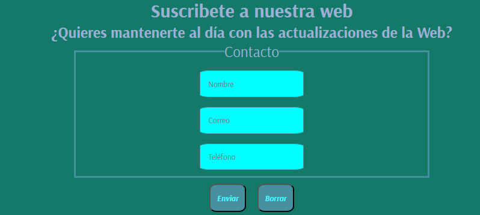

```html
<section id="form">
      <h2 id="contacto">Suscribete a nuestra web</h2>
      <h3>¿Quieres mantenerte al día con las actualizaciones de la Web?</h3>
      <form class="contacto">
        <fieldset id="fset1">
          <legend>Contacto</legend>
          <input type="text" placeholder="Nombre" required name="Nombre">
          <input type="email" placeholder="Correo" required name="Email">
          <input type="tel" placeholder="Teléfono" required name="Telf">
        </fieldset>
        <button type="submit"><strong><em>Enviar</em></strong></button>
        <button type="reset"><strong><em>Borrar</em></strong></button>
      </form>
    </section>
```

La galería de imágenes contiene diferentes imágenes sobre el gameplay del juego (las imágenes son sacadas de tiendas oficiales del juego), todas estas al pasar el cursor por encima hacen un efecto de zoom además de que al hacer click te llevan a la imagen ampliada.

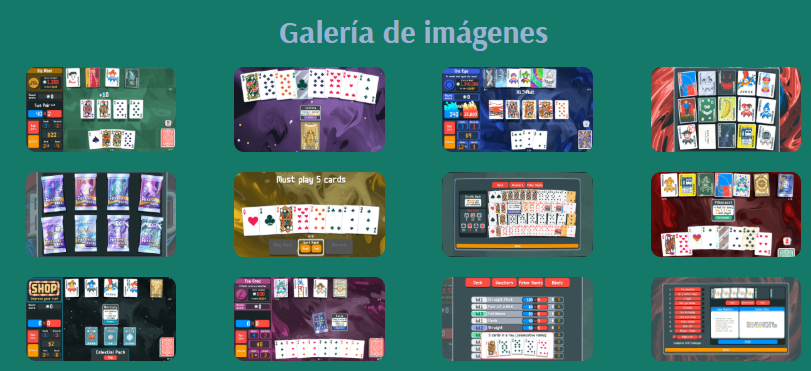

```html
<section id="galery">
      <h2>Galería de imágenes</h2>
      <figure>
        <a href="img/gallery1.png"></a>
        <a href="img/gallery2.png"></a>
        <a href="img/gallery3.png"></a>
        <a href="img/gallery4.png"></a>
        <a href="img/gallery5.png"></a>
        <a href="img/gallery6.png"></a>
        <a href="img/gallery7.png"></a>
        <a href="img/gallery8.png"></a>
        <a href="img/gallery9.png"></a>
        <a href="img/gallery10.png"></a>
        <a href="img/gallery11.png"></a>
        <a href="img/gallery12.png"></a>
      </figure>
    </section>
```

Respecto a los enlaces en la web tengo una sección con enlaces a redes oficiales de Balatro además de contener varios enlaces aparte como al principio del hero (externo) y los de los menús de navegación (internos).


Aquí se encuentran enlaces internos que llevan a las diferentes secciones.

```html
<nav class="main-nav">
      <ul>
        <li><a href="#hero">Inicio</a></li>
        <li><a href="#galery">Galería</a></li>
        <li><a href="#table">Manos</a></li>
        <li><a href="#form">Suscripción</a></li>
        <li><a href="#RRSS">Contacto</a></li>
      </ul>
    </nav>
```


Aquí se encuentran enlaces internos que llevan a las diferentes secciones.

```html
<nav id="sideMenu" class="side-menu">
    <ul>
        <li><a href="#hero">Inicio</a></li>
        <li><a href="#galery">Galería de imágenes</a></li>
        <li><a href="#table">Manos y su puntuación base</a></li>
        <li><a href="#form">Suscripción a la web</a></li>
        <li><a href="#RRSS">Redes sociales oficiales de Balatro</a></li>
      </ul>
  </nav>
```

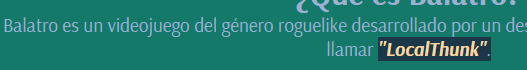

Aquí se encuentra un enlace externo al blog de Localthunk

```html
<a href="https://localthunk.com/"><strong><em class="golden">"LocalThunk"</em></strong>.</a>
```

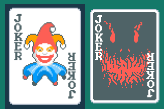

Aquí hay 2 enlaces externos que llevan a la wiki donde describen las funciones de ambos comodines.

```html
<figure>
          <a href="https://balatro.fandom.com/es/wiki/Comodín"></a>
          <a href="https://balatro.fandom.com/es/wiki/Cara_aterradora"></a>
        </figure>
```


Aquí se encuentran los enlaces externos que llevan a las imágenes completas de la galería.

```html
<h2>Galería de imágenes</h2>
      <figure>
        <a href="img/gallery1.png"></a>
        <a href="img/gallery2.png"></a>
        <a href="img/gallery3.png"></a>
        <a href="img/gallery4.png"></a>
        <a href="img/gallery5.png"></a>
        <a href="img/gallery6.png"></a>
        <a href="img/gallery7.png"></a>
        <a href="img/gallery8.png"></a>
        <a href="img/gallery9.png"></a>
        <a href="img/gallery10.png"></a>
        <a href="img/gallery11.png"></a>
        <a href="img/gallery12.png"></a>
      </figure>
    </section>
```

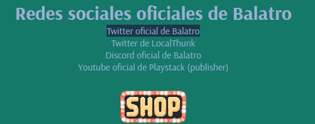

Aquí se encuentran una serie de enlaces externos que llevan a las redes sociales y a la tienda del juego.

```html
<section id="RRSS">
      <h2>Redes sociales oficiales de Balatro</h2>
      <ul>
        <li><a href="https://x.com/BalatroGame">Twitter oficial de Balatro</a></li>
        <li><a href="https://x.com/LocalThunk">Twitter de LocalThunk</a></li>
        <li><a href="https://discord.com/invite/5mH3dNhjx2">Discord oficial de Balatro</a></li>
        <li><a href="https://www.youtube.com/@playstack">Youtube oficial de Playstack (publisher)</a></li>
      </ul>
      <a href="https://store.steampowered.com/app/2379780/Balatro/" id="Steam"></a>
    </section>
```


Aquí se encuentra un enlace interno que lleva al inicio de la página.

```html
<a href="#hero">&copy; 2025 — 1º DAM, IES Saladillo</a>
```
